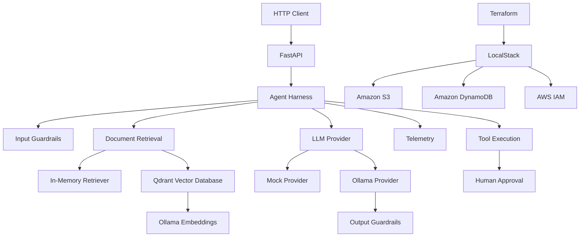

<div align="center">


### A practical enterprise AI platform for secure, governed, and observable agentic applications.

Build and explore AI agents with multi-tenant isolation, retrieval-augmented generation, controlled tool execution, human approval, and local cloud infrastructure.

<br/>

[](https://www.python.org/)
[](https://fastapi.tiangolo.com/)
[](https://www.docker.com/)
[](https://www.terraform.io/)

[](https://qdrant.tech/)
[](https://ollama.com/)
[](https://www.localstack.cloud/)
[](https://github.com/AGDM97/enterprise-agent-platform)

<br/>

[Overview](#-overview) •
[Architecture](#️-architecture) •
[Features](#-features) •
[Quick Start](#-quick-start) •
[Security](#-security-and-governance) •
[Roadmap](#️-roadmap)

</div>

---

## 🚀 Overview

**Enterprise Agent Platform** is a practical architecture laboratory focused on the patterns required to build enterprise-grade generative AI applications.

The platform combines:

- AI agent orchestration.
- Retrieval-Augmented Generation.
- Vector search and local embeddings.
- Multi-tenant document isolation.
- Group-based access control.
- Input and output guardrails.
- Controlled tool execution.
- Human approval for sensitive operations.
- Execution traceability.
- Infrastructure as Code.
- Local emulation of AWS services.

The project is designed to demonstrate architectural decision-making across AI engineering, cloud infrastructure, enterprise security, and software delivery.

> This is an educational and portfolio-oriented implementation. Some enterprise capabilities are represented as architectural foundations or local simulations rather than production-ready controls.

---

## 🏗️ Architecture



### Architectural layers

| Layer | Responsibility |
| --- | --- |
| API | Exposes HTTP endpoints and validates application contracts. |
| Application | Orchestrates agent execution, telemetry, and business workflows. |
| Domain | Defines models, policies, guardrails, interfaces, and tools. |
| Infrastructure | Implements model providers, vector retrieval, embeddings, and external integrations. |
| Cloud infrastructure | Provisions local AWS-like resources using Terraform and LocalStack. |

---

## ✨ Features

### 🤖 Agent orchestration

The agent harness coordinates the execution lifecycle:

1. Validate the incoming request.
2. Apply input guardrails.
3. Identify tool-related intents.
4. Verify approval requirements.
5. Enforce authorization rules.
6. Retrieve authorized documents.
7. Generate a response using the selected provider.
8. Register execution telemetry.
9. Return sources and trace information.

### 📚 Retrieval-Augmented Generation

Two retrieval strategies are available:

| Backend | Purpose |
| --- | --- |
| `memory` | Lightweight retrieval for development and automated tests. |
| `qdrant` | Vector-based retrieval for semantic search scenarios. |

Documents can carry metadata such as:

```json
{
  "document_id": "doc-001",
  "tenant_id": "maitha",
  "allowed_groups": [
    "architecture"
  ],
  "title": "Enterprise RAG Architecture"
}
```

Retrieval is restricted according to the requesting user's tenant and group memberships.

### 🧠 Local language models

The platform integrates with Ollama for local model execution.

Language model:

```text
llama3.2:1b
```

Embedding model:

```text
all-minilm
```

Embedding dimensions:

```text
384
```

Local execution supports experimentation without requiring a commercial model API for every interaction.

### 🛡️ Input guardrails

The application includes protections for scenarios such as:

- User-supplied `system` messages.
- Initial prompt injection patterns.
- Invalid request structures.
- Unauthorized access attempts.
- Restricted tool execution.

These controls are intentionally educational and should be expanded before production use.

### 📎 Output guardrails

Output validation includes:

- Document citation requirements.
- Validation of authorized document identifiers.
- Rejection of unauthorized citations.
- Detection of uncited response lines.
- Extractive fallback based on authorized documents.

Example:

```text
- Enterprise agents must enforce guardrails and access policies. [doc-002]
- Employees must comply with corporate security requirements. [doc-005]
- RAG combines document retrieval with language model generation. [doc-001]
```

> Valid citations alone do not guarantee that every generated statement is semantically grounded in its source. Runtime integration and semantic groundedness evaluation should be validated independently.

### 🧰 Controlled tool execution

Implemented tool:

```text
create_ticket
```

Tool execution considers:

- User intent.
- Group authorization.
- Human approval.
- Execution traceability.

Example authorized groups:

```text
engineering
architecture
```

### 👤 Human approval

Sensitive actions can require explicit approval before execution.

Current implementation:

```json
{
  "approval_granted": true
}
```

This represents a simplified educational approval mechanism.

Production implementations should use authenticated approval workflows, persistent records, and independent authorization controls.

### 🔎 Observability

Executions include a trace identifier:

```json
{
  "trace_id": "490c3e4a-fcbf-4f6f-b141-73537514159f"
}
```

Examples of observable events:

```text
agent_execution
guardrail
retrieval
llm_generation
tool_execution
```

Jaeger is available in the local environment as a foundation for future OpenTelemetry integration.

---

## 🔐 Security and governance

Security considerations explored in this project include:

| Control | Current implementation |
| --- | --- |
| Tenant isolation | Retrieval filters restrict documents by tenant. |
| Group authorization | Access depends on user group membership. |
| Prompt protection | Input guardrails detect selected unsafe patterns. |
| Tool governance | Sensitive tools require authorization and approval. |
| Source traceability | Responses can include document references. |
| Output validation | Dedicated guardrail validates citations and fallback behavior. |
| Execution traceability | Requests receive trace identifiers and telemetry events. |
| Infrastructure policy | Terraform provisions an IAM role and access policy in LocalStack. |

### Important limitations

The current project does not yet implement:

- Production-grade authentication.
- OAuth 2.0 or OpenID Connect.
- Independently authenticated approvals.
- Complete semantic groundedness verification.
- Full AWS-equivalent authorization behavior.
- Production secrets management.
- End-to-end distributed tracing export.

---

## ☁️ Local cloud infrastructure

Docker Compose supports the local infrastructure environment:

| Service | Purpose | Port |
| --- | --- | --- |
| LocalStack | AWS service emulation. | `4566` |
| Ollama | Local language models and embeddings. | `11435` |
| Qdrant | Vector database and semantic search. | `6333` |
| Jaeger | Observability interface. | `16686` |

Terraform provisions AWS-like resources in LocalStack:

### Amazon S3

```text
enterprise-agent-documents
```

Intended purpose:

```text
Document storage and future ingestion pipelines.
```

### Amazon DynamoDB

```text
enterprise-agent-approvals
```

Intended purpose:

```text
Persistent approval and authorization records.
```

### AWS IAM

```text
enterprise-agent-execution-role
```

Intended purpose:

```text
Application permissions based on least-privilege principles.
```

> S3 and DynamoDB resources are provisioned for architectural evolution. Current document ingestion and approval flows are not yet fully integrated with these services.

---

## 📁 Project structure

```text
enterprise-agent-platform/
│
├── app/
│   ├── api/
│   │   ├── __init__.py
│   │   └── routes.py
│   │
│   ├── application/
│   │   ├── agent_harness.py
│   │   └── telemetry.py
│   │
│   ├── core/
│   │   ├── __init__.py
│   │   ├── config.py
│   │   └── exceptions.py
│   │
│   ├── domain/
│   │   ├── __init__.py
│   │   ├── guardrails.py
│   │   ├── models.py
│   │   ├── output_guardrails.py
│   │   ├── providers.py
│   │   ├── retrieval.py
│   │   └── tools.py
│   │
│   ├── infrastructure/
│   │   ├── __init__.py
│   │   ├── in_memory_retriever.py
│   │   ├── index_documents.py
│   │   ├── mock_provider.py
│   │   ├── ollama_embeddings.py
│   │   ├── ollama_provider.py
│   │   ├── qdrant_retriever.py
│   │   └── ticket_tool.py
│   │
│   └── main.py
│
├── infrastructure/
│   └── local/
│       ├── main.tf
│       └── .terraform.lock.hcl
│
├── tests/
│   ├── __init__.py
│   ├── test_api.py
│   └── test_output_guardrails.py
│
├── .gitignore
├── docker-compose.yml
├── README.md
└── requirements.txt
```

---

## ⚡ Quick start

### Prerequisites

Install:

- Python 3.12.
- Docker.
- Docker Compose.
- Git.

Depending on your LocalStack configuration, a LocalStack authentication token may also be required.

### 1. Clone the repository

```bash
git clone https://github.com/AGDM97/enterprise-agent-platform.git
```

```bash
cd enterprise-agent-platform
```

### 2. Create a virtual environment

Windows PowerShell:

```powershell
python -m venv .venv
```

```powershell
.venv\Scripts\Activate.ps1
```

Linux or macOS:

```bash
python3 -m venv .venv
```

```bash
source .venv/bin/activate
```

### 3. Install dependencies

```bash
pip install -r requirements.txt
```

### 4. Start local infrastructure

If your LocalStack setup requires an authentication token:

```powershell
$env:LOCALSTACK_AUTH_TOKEN = "YOUR_TOKEN"
```

Start the services:

```bash
docker compose up -d
```

Verify their status:

```bash
docker compose ps
```

### 5. Download Ollama models

```bash
docker exec enterprise-ollama ollama pull llama3.2:1b
```

```bash
docker exec enterprise-ollama ollama pull all-minilm
```

Check installed models:

```bash
docker exec enterprise-ollama ollama list
```

### 6. Provision local AWS resources

Initialize Terraform:

```bash
docker compose run --rm terraform init
```

Validate the configuration:

```bash
docker compose run --rm terraform validate
```

Review the execution plan:

```bash
docker compose run --rm terraform plan
```

Provision the resources:

```bash
docker compose run --rm terraform apply
```

### 7. Index documents

```bash
python -m app.infrastructure.index_documents
```

Expected output:

```text
Indexed 5 documents in collection 'enterprise_agent_documents'.
```

### 8. Start the application

PowerShell with the in-memory retriever:

```powershell
$env:RETRIEVER_BACKEND = "memory"
```

```powershell
uvicorn app.main:app --reload
```

PowerShell with Qdrant:

```powershell
$env:RETRIEVER_BACKEND = "qdrant"
```

```powershell
uvicorn app.main:app --reload
```

Linux or macOS:

```bash
RETRIEVER_BACKEND=qdrant uvicorn app.main:app --reload
```

### 9. Open the API documentation

```text
http://localhost:8000/docs
```

Health check:

```text
http://localhost:8000/health
```

---

## 🔌 API example

### Request

```http
POST /v1/chat
Content-Type: application/json
```

```json
{
  "user": {
    "user_id": "angelo",
    "tenant_id": "maitha",
    "groups": [
      "architecture"
    ]
  },
  "messages": [
    {
      "role": "user",
      "content": "How can we protect data between different customers?"
    }
  ],
  "provider": "ollama",
  "temperature": 0.2,
  "approval_granted": false
}
```

### Illustrative response

```json
{
  "content": "Apply tenant isolation and document access controls. [doc-001]",
  "provider": "ollama",
  "model": "llama3.2:1b",
  "input_tokens": 120,
  "output_tokens": 35,
  "trace_id": "00000000-0000-0000-0000-000000000000",
  "sources": [
    {
      "document_id": "doc-001",
      "title": "Enterprise RAG Architecture"
    }
  ],
  "tool_execution": null
}
```

> Response content, token counts, document titles, and trace identifiers vary according to the configured dataset and runtime execution.

---

## 🧪 Testing

Run the test suite with the in-memory retrieval backend:

```powershell
$env:RETRIEVER_BACKEND = "memory"
```

```powershell
pytest -q
```

Current local development baseline:

```text
38 passed
```

The automated suite covers scenarios including:

- API contract validation.
- Request payload validation.
- Prompt injection protections.
- Tenant-based document isolation.
- Group-based access policies.
- Public document retrieval.
- Agent execution telemetry.
- Human approval requirements.
- Tool execution authorization.
- Language model provider behavior.
- Output citation validation.
- Unauthorized citation rejection.
- Extractive fallback responses.

> The displayed test count reflects the current development snapshot and may change as the project evolves.

---

## 🧭 Design principles

### Provider abstraction

Language model providers share a common interface, reducing application coupling to a specific model vendor.

Current implementations:

```text
MockLLMProvider
OllamaLLMProvider
```

Potential future integrations:

```text
Amazon Bedrock
Azure OpenAI
OpenAI API
Anthropic
```

### Security by design

Security policies are considered during:

- Request validation.
- Document retrieval.
- Tool selection.
- Approval workflows.
- Response generation.
- Execution auditing.

### Cloud portability

The current infrastructure uses AWS-like services locally, while the application architecture is designed around abstractions that can evolve across different environments.

### Explicit limitations

The repository distinguishes between:

- Fully implemented behavior.
- Locally simulated capabilities.
- Provisioned infrastructure.
- Planned integrations.

This prevents architectural diagrams from being mistaken for production-ready guarantees.

---

## 🗺️ Roadmap

### Security and identity

- [ ] OAuth 2.0 and OpenID Connect authentication.
- [ ] Identity-aware authorization.
- [ ] Centralized secrets management.
- [ ] Stronger prompt injection detection.
- [ ] Independent approval authorization.
- [ ] Policy-based tool access.

### Retrieval and document intelligence

- [ ] Direct ingestion from Amazon S3.
- [ ] Document chunking strategies.
- [ ] Hybrid search.
- [ ] Reranking.
- [ ] Improved multilingual embeddings.
- [ ] Metadata-aware retrieval improvements.

### Agent governance

- [ ] Persistent approvals in DynamoDB.
- [ ] Multi-step agent workflows.
- [ ] Tool execution auditing.
- [ ] Agent policy enforcement.
- [ ] Semantic groundedness evaluation.
- [ ] Runtime verification of output guardrail integration.

### Observability and quality

- [ ] OpenTelemetry instrumentation.
- [ ] Jaeger trace export.
- [ ] Structured application logging.
- [ ] Automated evaluation datasets.
- [ ] Latency and token usage dashboards.
- [ ] GitHub Actions pipeline.

### Cloud deployment

- [ ] Amazon Bedrock integration.
- [ ] AWS Lambda deployment.
- [ ] Amazon API Gateway integration.
- [ ] Container-based deployment.
- [ ] CI/CD deployment workflows.
- [ ] Production infrastructure modules.

---

## 👨‍💻 Author

<div align="center">

### Angelo Gustavo Dias Matias

**Solution Architect | Enterprise AI | Cloud Architecture | Generative AI**

Focused on secure enterprise AI solutions, agentic architectures, cloud platforms, governance, and practical software architecture.

[](https://www.linkedin.com/in/angelomatias/)
[](https://github.com/AGDM97)

<br/>

**Built to explore how enterprise AI systems can be useful, governable, and secure.**

</div>